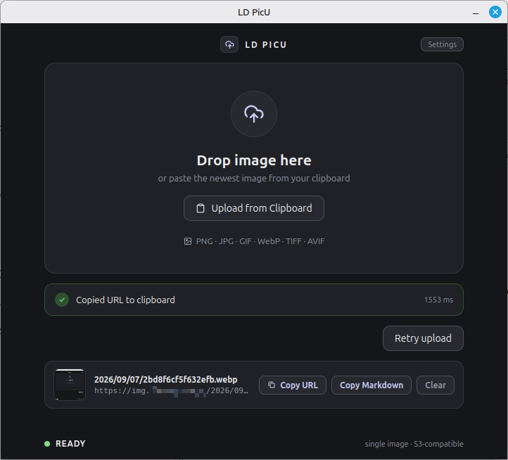
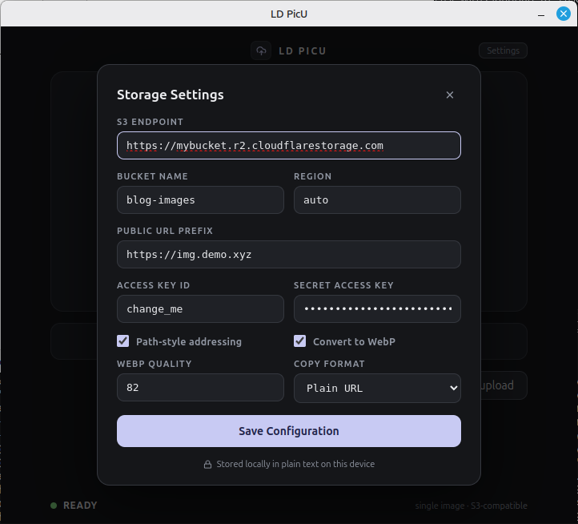

# LD PicU

LD PicU is a minimal desktop image uploader for S3-compatible object storage. It is built for personal use with Cloudflare R2, custom public domains, Windows 11, and Linux Mint.

## Screenshots





## Features

- Drag one image into the window to upload it.
- Upload the current clipboard image on demand.
- Convert static images to WebP before upload.
- Keep GIF and existing WebP files unchanged.
- Build object keys with date folders and random identifiers.
- Use a custom public URL prefix after upload.
- Copy plain URLs or Markdown image syntax automatically.
- Copy raw URLs or Markdown manually from the latest successful result.
- Keep the latest successful result visible until it is cleared or replaced.
- Run in the system tray after the main window is closed.

## Requirements

- Node.js 22 or later
- An S3-compatible object store
- An access key with permission to upload objects to the configured bucket

## Development

```bash
npm install
npm run dev
```

## Build Packages

```bash
# Linux AppImage and deb
npm run package -- --linux

# Windows NSIS installer
npm run package -- --win
```

Build output is written to `release/`.

## Storage Settings

Configure these values from the in-app **Settings** window:

| Setting | Cloudflare R2 example |
| --- | --- |
| Endpoint | `https://<account-id>.r2.cloudflarestorage.com` |
| Bucket | Your R2 bucket name |
| Region | `auto` |
| Access Key ID | R2 API token access key |
| Secret Access Key | R2 API token secret |
| Public URL Prefix | `https://img.example.com` |

For R2, enable path-style addressing if your endpoint configuration requires it.

## Security Note

LD PicU stores its settings, including S3 credentials, as plaintext JSON in Electron's user-data directory. This is an intentional personal-use MVP trade-off. Do not share that configuration file or commit credentials to Git.

On Linux, the configuration file is typically located at:

```text
~/.config/ld-picu/config.json
```

The application attempts to restrict this file to the current user with `0600` permissions.

## License

This project is released under the [MIT License](LICENSE).
